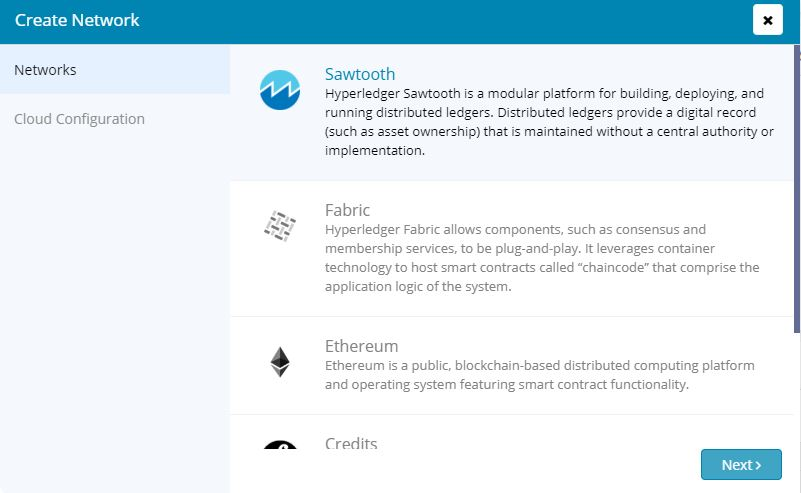
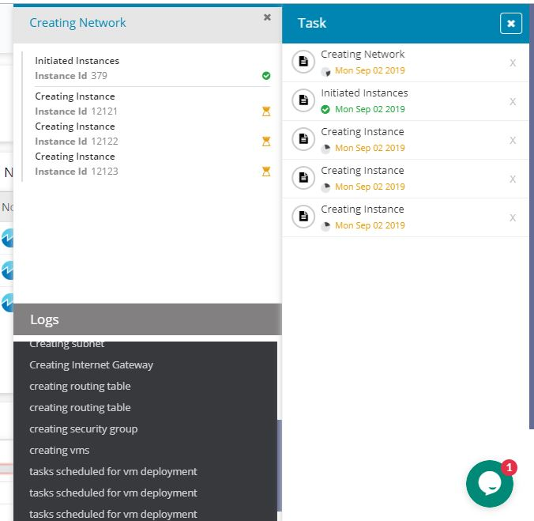

# How to create my first Network?

Zeeve makes the process of blockchain network deployment from a long time consuming one to just a matter of few clicks whilst taking care of the most important bits.

With a handful of steps using [Zeeve](https://zeeve.io), it has become so easy to create your own blockchain network. These networks can also be altered as per the need of the required deployment with the help of  given protocol specific parameters that helps you align with your desired network performance.

<!-- Currently we have restricted for below mentioned with which user can create the Blockchain network. Initially you should choose your blockchain platform -->

### Selecting A Blockchain Protocol

So to go ahead with the network creation, you first need to decide and pick one out of the major blockchain protocols out there, This decision might be driven majorly by the needs of your usecase. We have something for you [here](./Blockchain_Protocols.md) which might help you to get started.
<!-- 
> *   [Hyperledger Sawtooth](./Glossary.html#hyperledger-sawtooth)
> *   [Hyperledger Fabric](./Glossary.html#hyperledger-fabric)
> *   [Ethereum](./Glossary.html#ethereum)
> *   [Credits](./Glossary.html#credits)
> *   [Corda](./Glossary.html#corda) -->

After selecting the protocol just configure your network as per the desired network parameters and then you are good to go. To see protocol specific configuration parameters please refer to the detailed deployment spec using the following links:
<!-- These are the logs coming while creating a [network](./Glossary.md) -->

> *   [Hyperledger Sawtooth Deployment Specifications](./HyperledgerSawtooth.md)
> *   [Hyperledger Fabric Deployment Specifications](./HyperledgerFabric.md)
> *   [Ethereum  Deployment Specifications](./Ethereum.md)
> *   [Corda Deployment Specifications](./Corda.md)
> *   [Credits Deployment Specifications](./Credits.md)

## Selecting A Cloud For The Network

The next step is to specify the cloud via which you wish to deploy your network.

<!--   Here multiple cloud network available users can choose the cloud as per choice. -->
  Choose a cloud* to deploy the network and configure the following settings :

> *   **Name of Network** : In order to uniquely identify your network, this field requires a unique name for it. Unique over here is in terms of the account in which you are creating your network. In case you have created some network earlier, and now you are trying to create with the same name, then the [Zeeve](https://zeeve.io) platform won't allow you to create it.
> *   **Location** : It indicates the region of cloud service viz., AWS or Azure. These regions are the geographic locations where your network instances are going to be hosted. In case of AWS each of its Region has multiple, isolated locations known as Availability Zones. Amazon RDS provides you the ability to place resources, such as instances, and data in multiple locations. Resources aren't replicated across AWS Regions unless you do so specifically. [Ref.](https://docs.aws.amazon.com/AmazonRDS/latest/UserGuide/Concepts.RegionsAndAvailabilityZones.html)
> *   **Type of Instance** : It defines the combination of CPU cores and memory. Choose the configuration which could handle the loads of your network. This parameter is useful for scaling up the network. Type of Instances may vary from cloud to cloud.
> *   **Number of Instances** : It defines the number of instances. This parameter is useful for scaling out the network.

<i><small>(*Make sure you have authorized Zeeve to connect to your desired cloud account. Not done it yet? Head to [Cloud Authorizations](./cloud_authorization).)</small></i>

## Exploring Your Network

Zeeve also provides you with just a few insights about your network, ranging from what happens while Zeeve is bringing it up & beyond. 

### TaskBar
To track every bit of the network lifecycle. Just switch to the tasks section to get an essence of what all Zeeve is actually doing for you on just a few clicks of yours.

This is how a taskbar looks after placing a few back to back network creation requests.
<!-- These are the logs coming while creating a [network](./Glossary.md) -->

### Node Listing

You can also view the nodes related to your network. Once nodes have been created they will be displayed with an **Online** status. User can click a node to view the individual node details.

