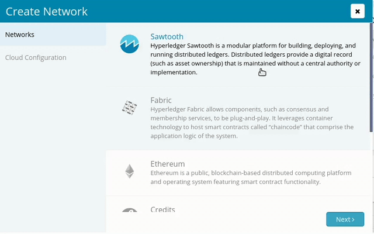

#  Hyperledger Fabric Deployment Specifications

[Hyperldger Fabric](Glossary.md) is an open-source enterprise-grade permissioned [[Glossary|distributed ledger]] technology (DLT) platform, designed for use in enterprise contexts, that delivers some key differentiating capabilities over other popular distributed ledger or blockchain platforms.

> 

<ins>Certain steps which helps in configuring a network are based upon the selections of the parameters</ins>

## **Step 1** : Passing the values for the Orderer Service and Organization under Topology section

> 

### **Orderer Service**

**Orderers** are considered as the special nodes, which are helping each peer nodes to have consistent ledger by enabling the interaction of peer nodes and applications participating in the network. So based upon the requirement, you need to specify the number of orderers.

**Kafka** is a message handling system which uses Publish-Subscribe model. Consumers subscribe to the topic to receive new messages, that are published by a Producer. Topics are nothing but messages, so when they become huge in number, then they are split into partitions, and Kafka guarantees that all messages inside a partition are sequentially ordered. Hyperledger Fabric ordering service nodes (OSNs) use the Kafka cluster and provide an ordering service to your blockchain network. Kafka is permissioned voting based consensus type, here leader does the ordering, only in-sync can be voted as leader. 

**Zookeeper** is a distributed key-value store, most commonly used to store metadata and handle the mechanics of clustering. It allows clients of the service (the Kafka brokers) to subscribe and have changes sent to them once they happen. This is how brokers know when to switch partition leaders. Zookeeper is also extremely fault-tolerant as it ought to be, since Kafka heavily depends on it.

### **Organization**

**Number of Nodes** indicates the number of peers in the blockchain network. There are different roles defined for the peers involved in the network. One of the role is " **Anchor peer** "
Anchor peer's role is to broadcast the block, created by orderer node, to other peers inside the organization. It is the one who is directly interacting with Orderer node. Number of Anchor peer should be greater than zero.

## **Step 2** : Configuring CSR section which is Optional

> 

CSR is Certificate Signing Request. [Ref.](https://hyperledger-fabric-ca.readthedocs.io/en/release-1.4/users-guide.html#fabric-ca-server)

## **Step 3** : Configuring the Channel details

> 

### **Channel Details**

**Channel Name** indicates the name uniqueness with which it is known in the architecture.

**Batch Timeout** is the amount of time to wait after receiving first transaction, in order to receive more transactions before cutting a block. In case if we decrease this value then we get lower latency but decreasing too much will result in the decrease of throughput, as block will not fill to its maximum capacity. [Ref.](https://hyperledger-fabric.readthedocs.io/en/release-1.4/config_update.html)

> As indicated in the above screenshot `{ "timeout": "2s" }`

**Batch Size** is a group of three different parameters which are governing it by dictating the number and size of transactions in a block. **Maximum Message Count** indicates the maximum number of transaction in a block. 
Also, if we look into **Absolute Maximum Bytes** field, then it indicates the maximum size of a block which can be build in the channel. In respect of **Absolute Maximum Bytes**, there is another parameter viz., **Preferred maximum Bytes** which is nothing but the minimum size of a block. [Ref.](https://hyperledger-fabric.readthedocs.io/en/release-1.4/config_update.html)

> As indicated in the above screen
 `{
  "absolute_max_bytes": 103809024,
  "max_message_count": 10,
  "preferred_max_bytes": 524288
 }`