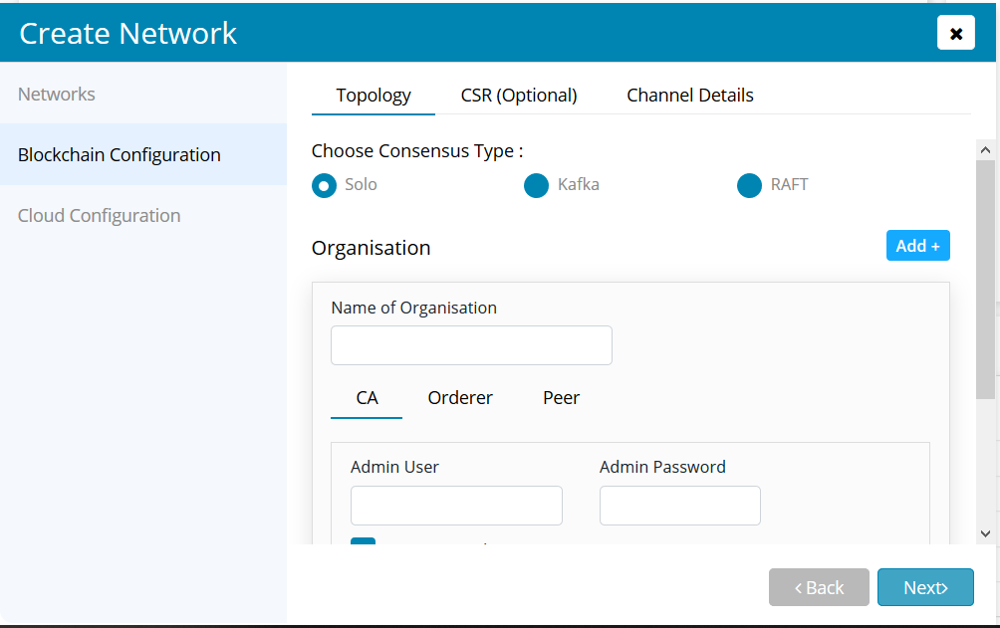
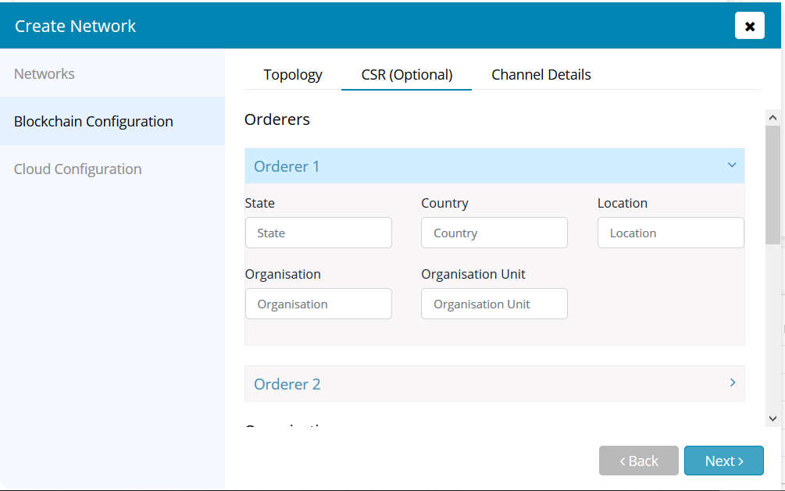
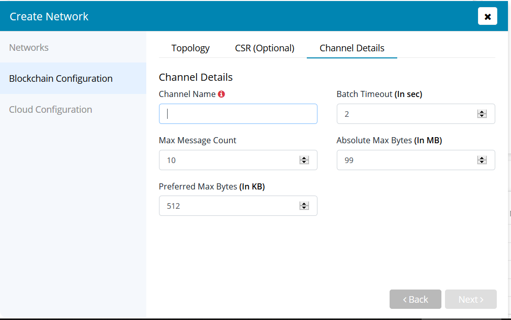

#  Hyperledger Fabric Deployment Specifications

Hyperledger Fabric has one of the most exhaustive set of available configuration parameters. 
 
This page would help you a lot to achieve a highly customised fabric network.
Fabric network creation is spread across 3 sections. Please read further to know about each of them. 

> 

<!-- <ins>Certain steps which helps in configuring a network are based upon the selections of the parameters</ins> -->

## **Step 1** : Configuring Consortium (Organizations) under Topology Section

 

### Consortium

A fabric network is made up of a group of organizations wherein an organization is a mere stakeholder(participant) of the network, this group is called as a consortium. You can add an organization by pressing the add button alongside the organization keyword and after that add a name for this organization.

Each organization participate in the network via a few fabric specific pillars namely [orderer](./Glossary.html#orderer), [peer](./Glossary.html#peer) and [certificate authority](./Glossary.html#certificate-authority).

#### Certificate Authority 
    
CA(Certificate Authority) can be configured just by providing the admin user name and password under the selected organization.

#### Ordering Service

Zeeve supports all the three types of ordering service, which are provided by HL Fabric namely <strong>Solo</strong> (Single Orderer Network), <strong>[Kafka](./Glossary.html#kafka)</strong> and <strong>[Raft](./Glossary.html#raft)</strong>. Making it one of the best tools for deploying fabric based production networks. 

So based upon the requirement, select the type of ordering service and just add the number of orderers using the Add Orderer button under the orderer tab of the organization section. 

**Not To Forget:** Zeeve provides you with decentralized ordering service out of the box; allowing each organization to have their own orderering service which ends the need of keeping extra orderer organizations. Go ahead and try creating a network with multiple organizations each having a number of orderers.

 #### Peer Service

 A peer can be added to the organization by using the add button under the peer tab of the organization section. You just need to choose the type of peer service for each peer you want to go with, it can be either levelDb or couchDb based and specify whether you want to have a persistent volume for the same.

<!-- 
One of the role is " **Anchor peer** "
Anchor peer's role is to broadcast the block, created by orderer node, to other peers inside the organization. It is the one who is directly interacting with Orderer node. Number of Anchor peer should be greater than zero. -->

## **Step 2** : Configuring CSR (Optional)

> 

CSR is Certificate Signing Request. [Ref.](https://hyperledger-fabric-ca.readthedocs.io/en/release-1.4/users-guide.html#fabric-ca-server)

## **Step 3** : Configuring the Channel Details

> 

### System Channel

**Batch Timeout** is the amount of time to wait after receiving first transaction, in order to receive more transactions before cutting a block. In case if we decrease this value then we get lower latency but decreasing too much will result in the decrease of throughput, as block will not fill to its maximum capacity. [Ref.](https://hyperledger-fabric.readthedocs.io/en/release-1.4/config_update.html)

> As indicated in the above screenshot `{ "timeout": "2s" }`

**Batch Size** is a group of three different parameters which are governing it by dictating the number and size of transactions in a block. **Maximum Message Count** indicates the maximum number of transaction in a block. 
Also, if we look into **Absolute Maximum Bytes** field, then it indicates the maximum size of a block which can be build in the channel. In respect of **Absolute Maximum Bytes**, there is another parameter viz., **Preferred maximum Bytes** which is nothing but the minimum size of a block. [Ref.](https://hyperledger-fabric.readthedocs.io/en/release-1.4/config_update.html)

> As indicated in the above screen
 `{
  "absolute_max_bytes": 103809024,
  "max_message_count": 10,
  "preferred_max_bytes": 524288
  }`

### Application Channel (Optional)

  You have an option to create an application channel and make all the peers defined in the topology section join the same.

  **Channel Name** indicates the name uniqueness with which it is known in the architecture.