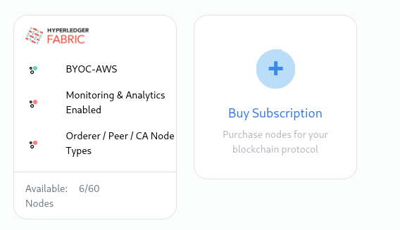
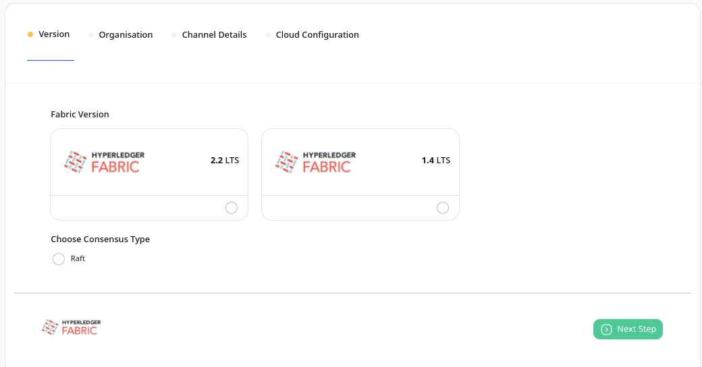
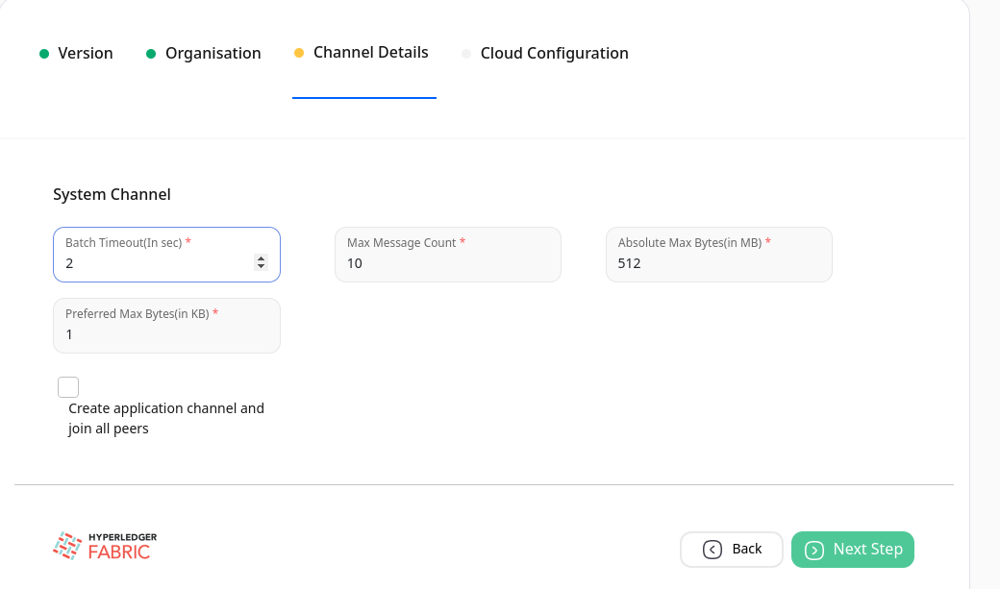
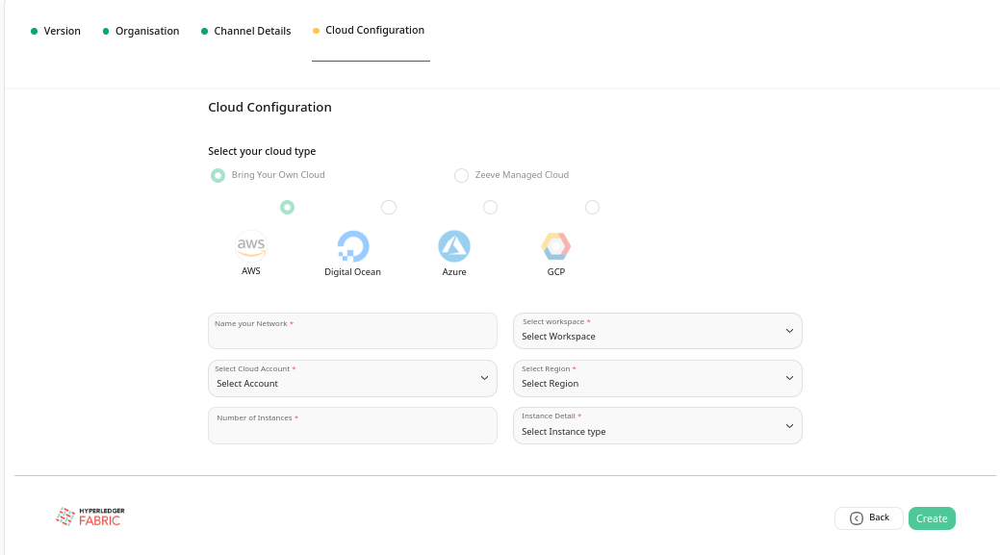
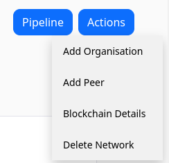
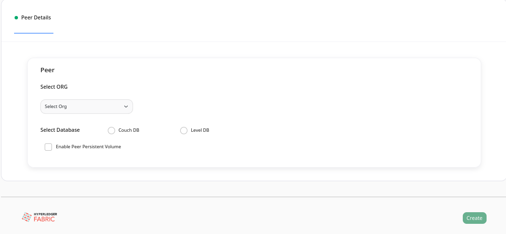
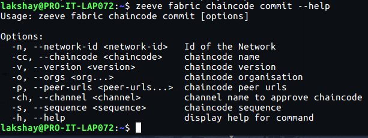
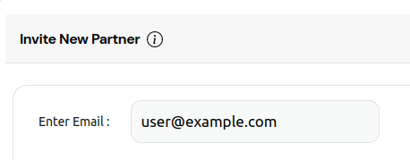

# Hyperledger Fabric Dedicated Node Setup

Hyperledger Fabric has one of the most exhaustive sets of available configuration parameters. 
<br/>
This page would help you a lot to achieve a highly customized fabric network.

1. [Create network](#create-a-network)
2. [Add peer](#add-peer)
3. [Add organization](#add-organization)
4. [Zeeve CLI](#zeeve-cli)

### **Create a network**
Fabric network creation is spread across 4 sections. Please read further to know about each of them. <br></br>
On the **Network Configuration** page you will have different cards with different network configurations for Fabric, which looks similar to the image provided below. 

  

---
***NOTE:** These cards can be different for your case. Card configurations totally depend on your purchased subscription.*

---

Choose the configuration you want. Click on the card and follow the steps accordingly.


1. In the first step choose the **Fabric version** and **Consensus** type. After that click on **Next Step** button.<br></br>
  

2. A fabric network is made up of a group of organizations wherein an organization is a mere stakeholder(participant) of the network, this group is called a consortium. You can add an organization by pressing the **Add organization** button and after that add a name for this organization.<br></br>
  

    Each organization participate in the network via a few fabric specific pillars namely [orderer](./Glossary.html#orderer), [peer](./Glossary.html#peer) and [certificate authority](./Glossary.html#certificate-authority).<br></br>

    >*  **CA**: CA(Certificate Authority) can be configured just by providing the admin user name and password.
    >* **Orderer**: Zeeve supports all the three types of ordering service, which are provided by HL Fabric namely <strong>Solo</strong> (Single Orderer Network), <strong>Kafka</strong> and <strong>Raft</strong>. Making it one of the best tools for deploying fabric-based production networks. 

    <br></br>So based upon the requirement, select the type of ordering service and just add the number of orderers using the Add Orderer button under the orderer tab of the organization section. 

3. This is the step to configure the channel details.<br></br>
  

   >*  **Batch Timeout** is the amount of time to wait after receiving the first transaction, in order to receive more transactions before cutting a block. In case we decrease this value then we get lower latency but decreasing too much will result in a decrease in throughput, as the block will not fill to its maximum capacity.
    > *   As indicated in the above screenshot `{ "timeout": "2s" }`
    > *   **Maximum Message Count** indicates the maximum number of transactions in a block. 
    Also, if we look into
    > *   **Absolute Maximum Bytes**: It indicates the maximum size of a block that can be built in the channel.
    > *   In respect of **Absolute Maximum Bytes**, there is another parameter viz.,
    > *  **Preferred maximum Bytes** which is nothing but the minimum size of a block.

4. This is the last step in creating a network. select the region for the network by clicking on **Select Region**, select the [AWS](./cloud_authorization.md) account you want to use by clicking on **Select Cloud Account**, also choose the instance type as your requirement by clicking on **Select Instance Type**, and then click on the **Create** button. <br></br>
  
    

> * **Region**: It indicates the region of cloud service. These regions are the geographic locations where your network instances are going to be hosted. In the case of AWS, each of its regions has multiple, isolated locations known as Availability Zones. Amazon RDS provides you the ability to place resources, such as instances, and data in multiple locations. Resources aren't replicated across AWS Regions unless you do so specifically. [Ref.](https://docs.aws.amazon.com/AmazonRDS/latest/UserGuide/Concepts.RegionsAndAvailabilityZones.html)
> * **Cloud Account**: It represents the AWS cloud account that is going to be used for network creation. 
> *   **Type of Instance**: It defines the combination of CPU cores and memory. Choose the configuration which could handle loads of your network. This parameter is useful for scaling up the network. The type of Instances may vary from cloud to cloud.

### **View Network**
1. Click on **Networks** on the left side navigation bar.

    

2. You will be landed on a page similar to the below image. You can view all of your networks listed on this page.

    

---
***NOTE*** This page can be different in your case.

---
3. Select the Fabric network you want. After clicking on the network card you can view the nodes attached to the selected network. Network Nodes are listed with details - node’s unique ID and cloud provider, an organization it is part of, node’s role(peer, ca, orderer), and node’s deployment region.

    

4. Pipelines are listed with details - pipeline unique ID, the status of the pipeline(completed, in progress, failed), Total Jobs that it holds, and Action (to open up jobs inside it).

    


### **Add peer**
 A peer can be added to the organization by only following the two steps mentioned below. You just need to choose the type of peer service for each peer you want to go with, it can be either level Db or CouchDB based, and specify whether you want to have a persistent volume for the same.

1. Select the network to which you want to add a node, and click on the network card [Ref.](./View_your_network_and_nodes.md). You will get to see similar to the below image.<br></br>
    

2. Click on **Actions** button and select **Add Peer**.<br></br>
    

3. You will get to see a web page similar to the image provided below. Fill the details and click **create** button.<br></br>
    

### **Add organization**

1. Select the network to which you want to add a node, and click on the network card [Ref.](./View_your_network_and_nodes.md). You will get to see similar to the below image.<br></br>
    

2. Click on **Actions** button and select **Add Peer**.<br></br>
    
  
3. You will get to see a web page similar to the image provided below. Fill the details and click **create** button.<br></br>
  


## **Zeeve CLI**

  This section talks about how to use the Zeeve CLI and how to perform fabric chain code operations.

  1. [Create CLI access](#create-cli-access)
  2. [Chaincode pipelines](#chaincode-pipelines)

### **Create CLI Access**

1. Navigate to settings and then click on “API Credentials” to see a list of CLI/API credentials.
2. Click “Create key”.
3. Provide a name, and select one or more networks to associate with the key.
4. Add appropriate permissions for the operations that the keys are being created.
5. Click “Create key” and then copy/save generated keys.


### **Chaincode Pipelines**

1. Login with Zeeve CLI using the earlier created keys and add these URLs as well - <br></br>
    ```
     zeeve login -i < access-key > -s < secret-key > -ae https://app.zeeve.io/auth/cli/login -fe https://app.zeeve.io/fabric-backend/
    ```

2. Zeeve CLI supports fabric chaincode operations - package, install, deploy, approve and commit. 
3. Package: builds chaincode image, creates ECR and pushes into ECR, and creates chaincode connection package to be installed onto peers. Zeeve chaincode pipelines can deploy chaincode as a service (For more details). Following are the inputs required to run package operation
     - Chaincode zip file is a compressed file of chaincode with the name chaincode.tar.gz
     ```
      zeeve fabric chaincode package -f /path/to/chaincode.tar.gz -n 44b28e1f-7296-42a4-8904-e04341edfb27 -c marbles2 -v 1.0 -o org1 <br></br>
      ```
     
4. Install: runs chaincode install operation on given peer URLs.
    - The install operation can be run on a set of peers in a given org with the peer-URLs option.
    ```
     zeeve fabric chaincode install -n 44b28e1f-7296-42a4-8904-e04341edfb27 -c marbles2 -v 1.0 -o org1 -p peer1.org1.example.fabric.zeeve.net, peer2.org1.example.fabric.zeeve.net
     ```
    
5. Deploy: starts chaincode pod/service in Kubernetes cluster.
    ```
    - zeeve fabric chaincode deploy -n 44b28e1f-7296-42a4-8904-e04341edfb27 -c marbles3 -v 1.0 -o org1 -p peer1.org1.example.fabric.zeeve.net ,peer2.org1.example.fabric.zeeve.net
    ```
6. Approve: runs ‘peer chaincode approve’ on a set of given peers in an org in the channel provided.
    ```
     zeeve fabric chaincode approve -n 44b28e1f-7296-42a4-8904-e04341edfb27 -cc marbles3 -v 1.0 -o org1 -p peer1.org1.example.fabric.zeeve.net, peer2.org1.example.fabric.zeeve.net -ch mychannel -s 1 
    ```
   
7. Commit: runs ‘peer chaincode commit’ and also inits the chaincode with Init method on the given set of peers and organizations in the provided channel.
   ```
    zeeve fabric chaincode commit -n 44b28e1f-7296-42a4-8904-e04341edfb27 -cc marbles3 -v 1.0 -o org1,org2 -p peer1.org1.example.fabric.zeeve.net,peer2.org1.example.fabric.zeeve.net -ch mychannel -s 1 
    ```
   


## **Multitenant Networks**

Zeeve also supports the creation of Mulitenant networks in Hyperledger Fabric. This means that two or more users may be part of a network and may perform network operations collectively.

### **Inviting A User**

1. Select the network to which you want to add a node, and click on the network card.
2. Click on the Manage Invites tab and click on Invite New Partner. 
3. Enter the Email Address of the user to invite. 
4. Select the system channel checkbox if you want the invited user's organization to have orderers or be a part of the consortium. 
5. Fill in the maximum number of orderers for the new user. 
6. Select the consortium checkbox to add the user to consortium. Also fill in the system channel policy for the new organization. 
7. Select the application channel checkbox to make the new organization a part of atleast one pre-existing application channel. 
8. Click on the dropdown and select the channel you want to new organization to be a part of. You can select more than one channels but alteast one application channel is required. 
9.  Fill in the channel policy for the application channel.  
10. Repeat this for all application channels.
11. When all the details are filled, click on the "Submit" button. This will send an invite to the user.  

### **Accepting The Invite**

1. Go to the settings page
2. Click on the Network Invite tab. <br /> 
3. Click on the **View Details** button for the invite. 
4. Verify the details and click on approve. 
5. Fill in the details of the new organization.
6. Click on submit to deploy the new organization.

## **Certificate Renewal**

Zeeve supports the ability to renew your fabric certificates at a click of a button. Hyperledger fabric network certificates expire in 365 days. This means that certificates need to be renewed atleast once a year.

### **Renewing Certificates**

1. Click on **Renew Certs** button on actions tab. 

2. You can see the details of the certificate renewal with expiry date. 

3. Select the organizations for which you need to renew the certificates and click on Renew button. 

