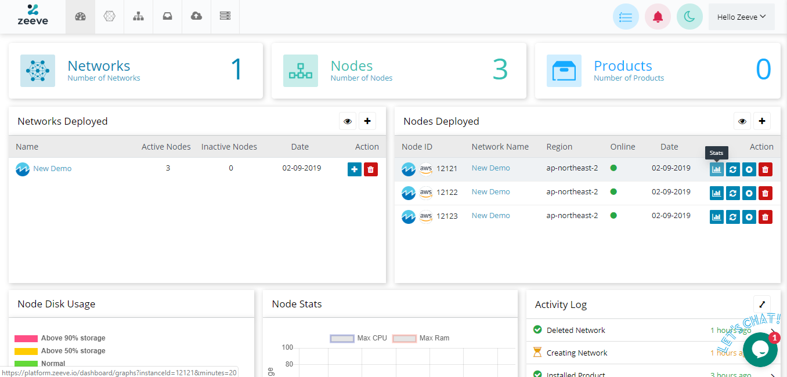
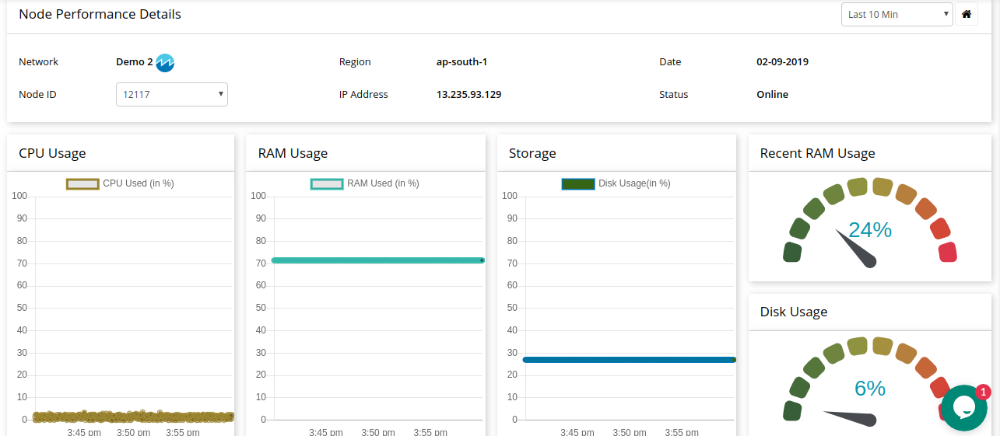

# Performance Metrics

> The supported rate of transactions per second is barely affected by the number of nodes since each node independently processes all transactions. You will see more latency as transactions and blocks have to make more hops to propagate to the entire network. This action page contains information on Node Performance Details like Network, Region, Created Date, Node ID, IP Address, Node Status, CPU Usage, RAM Usage, Storage, Recent RAM Usage, Disk Usage, [[Glossary|Inodes]], Network Usage and Load. We can monitor our network in this action.
> 
> To check the performance details of Nodes, do the following:
> 
> ### Go to Nodes page and click on stats bar of a node
> 
> We can check node performance details by navigating the dashboard page or Nodes page, performance details are based upon time duration, we can see in right side drop-down menu, where we can select options like the Last 10, 20, 30, 40 and 50 Min, based upon our selection node performance details will be shown.

### Find your Node Performance details

Node Performance details show the Network Name, Region, Node ID, IP Address, Status, CPU Usage(in % percentage), RAM Usage(in %), Storage(Disk Usage in %), Recent RAM Usage(in %), Inodes(in %), Network Usage(in Bar Graph) and Load(in Bar Graph). So with the help of this information, anyone can monitor their resource usage.

