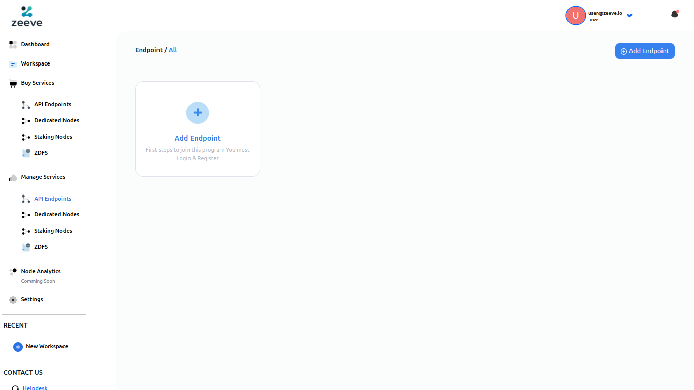
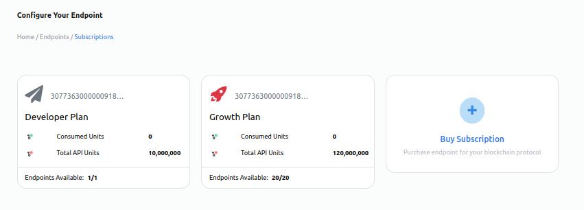
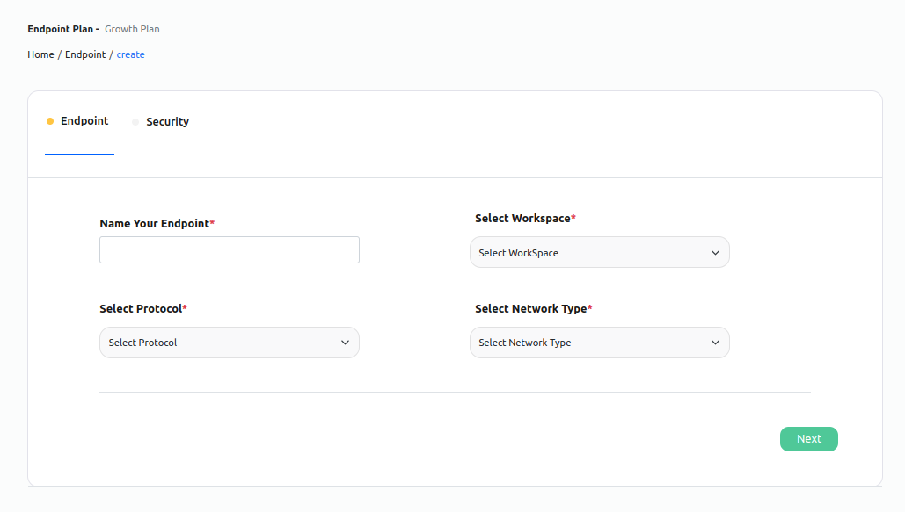
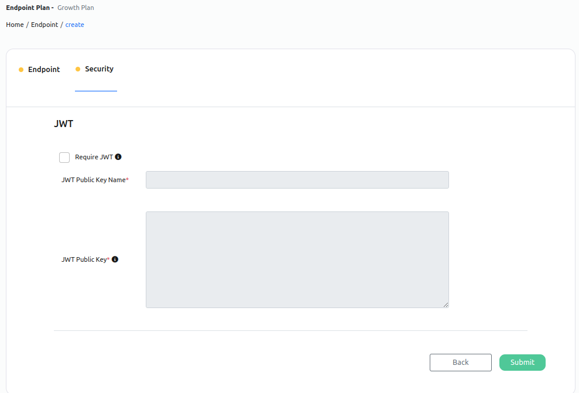
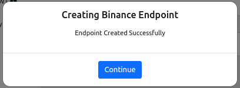

# API Endpoints

This page has detailed steps on how to

1. [Create an endpoint](#create-an-endpoint)

2. [Modify an endpoint](#modify-endpoint)
   - Change name
   - Update security
3. [Delete an endpoint](#delete-endpoint)

---

### **Create an endpoint**

**NOTE:** [Purchase](./subscriptions.md) a subscription plan before proceeding.

This section will provide you detailed steps for creating an API endpoint.

Visit the API Endpoints page by clicking on **API Endpoints** under **Manage Services** from the left side pane.

&nbsp;

Click on **Add Endpoint** card or the button on top right corner. You will be able to see all the subscriptions you bought for the API endpoints.

**NOTE:** These cards can be different based on your purchased subscriptions.

**NOTE:** The card will not be visible if the _API Units_ or the _Endpoint_ quota for that subscription has been exhausted.

Click on the card to choose the subscription in which you want add the endpoint. This will redirect you to the endpoint setup page.

1. **Endpoint Info**

   This step configures the basic and blockchain protocol settings for the endpoint.

   

   - **Endpoint Name:** The name of your endpoint.
   - **Workspace:** The workspace in which the endpoint will be added.
   - **Protocol:** The blockchain protocol for which the endpoint is created.
   - **Network Type:** The network type of the selected blockchain protocol.

   Proceed further by clicking on the **Next Step** button after providing all the details.
     

2. **Security Configuration (Optional)**

   This step configures the security settings for the endpoint. An option to add a **JWT** in your API call to make your endpoint more secure.

   
   &nbsp;

   - **Require JWT:** Enable this checkbox if you want to add a JWT security option.
   - **Public Key Name:** The name associated to the _public key_.
   - **Public Key:** The public key of a assymetric key-pair. Only keys generated using **_RSA_** and **_ECDSA_** algorithms are allowed.

On clicking the **Submit** button a pop-up window will open which ensures the successful creation of your endpoint.

> > > > > > 

&nbsp;

On clicking the **Continue** button you will be redirected to the page where you can see the endpoint you created.

---

### **Modify Endpoint**

This section will guide you on how you can modify an endpoint's

- Name
- Security

Visit the endpoint detail page of your endpoint (Manage Services > API Endpoints > Your Endpoint).

Click on the **_Edit_** icon in the top right corner.

> > > > > > > > > > > 

- **Change Endpoint Name**

  After clicking the **_Edit_** icon the endpoint name field will become editable. Update the name as required.

  Then click the **_Save_** button beside the input field to save the name.

  A pop-up will confirm the successful updation of the endpoint name.

- **Modify Endpoint Security**

  After clicking the **_Edit_** icon the security section will become editable.

  Toggle the security toggle as per the requirement to turn on or off the JWT security option.

  Then click the **_Save_** button below to save the update in security.

  A pop-up will confirm the successful updation of the endpoint security.

---

### **Delete Endpoint**

Visit the endpoint detail page of your endpoint (Manage Services > API Endpoints > Your Endpoint).

Click on the **_Delete_** icon in the top right corner.

> > > > > > > > > > > > 

A confirmation window will open, click on the **Yes** button to delete the endpoint.

> > > > > > 

&nbsp;

---
