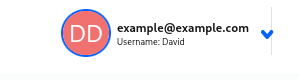
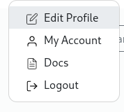
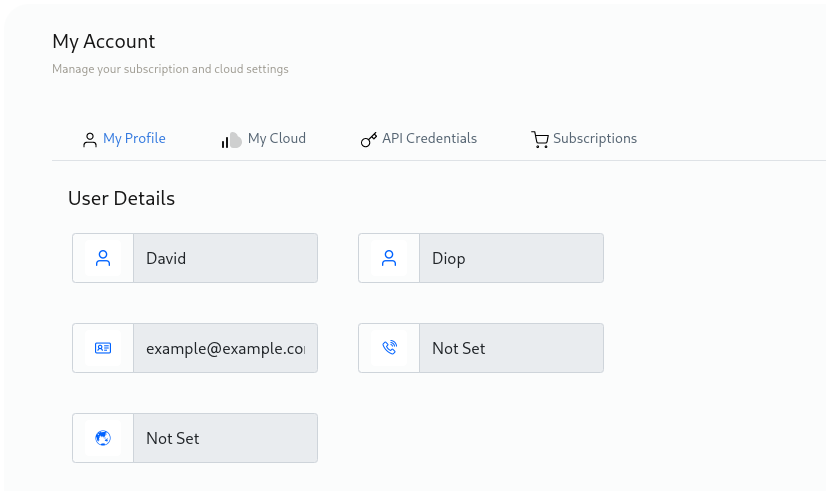
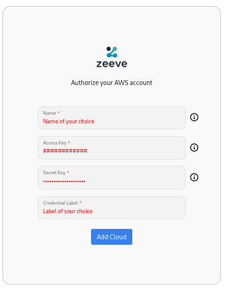

---
description:Explore the best practices and technical details for managing authorization in Zeeve's cloud-based platform. Learn how to secure your data and control access to resources with our API and tools.
---
# Cloud Authorizations

Zeeve allows you to authorize multiple cloud accounts of yours so as to create networks in the cloud of your choice. You may choose to deploy some nodes of network on one cloud and extend some nodes of the same on another. This cross cloud deployment maybe a major requirement for your usecase or clients especially for creating/expanding consortiums.

Zeeve supports a list of cloud for you to choose from. You can authorize multiple clouds and choose between them at the time of creating networks or nodes. Following is the list of currently supported clouds:-

1. AWS
2. Digital Ocean
3. GCP
4. Vultr
5. Tencent Cloud

---
***INTERESTING FACT:** Zeeve doesn't use **blockchain services** of any of the supported cloud platforms, and hence is not restricted for the level of features it can provide for a protocol on any cloud.*

---


## AWS Authorization

Before you authorize your AWS account with Zeeve, you'll need following permissions to deploy a network:
> * Permission to create VPC, Elastic Ips, EC2 instance, Security group, Internet gateway and Route tables.
> * For Fabric, you need additional permissions to read/write EKS, CloudFormation and to create and pass any Role in IAM.
> * Specific Permissions in AWS Account:
>     * AmazonEC2FullAccess
>     * ServiceQuotasReadOnlyAccess
>     * "eks:UpdateClusterVersion"
>     * "eks:ListTagsForResource"
>     * "eks:UpdateAddon"
>     * "eks:ListAddons"
>     * "eks:UpdateClusterConfig"
>     * "eks:DescribeAddon"
>     * "eks:UpdateNodegroupVersion"
>     * "eks:DescribeNodegroup"
>     * "eks:AssociateEncryptionConfig"
>     * "eks:ListUpdates"
>     * "eks:DescribeAddonVersions"
>     * "eks:ListIdentityProviderConfigs"
>     * "eks:CreateCluster"
>     * "eks:ListNodegroups"
>     * "eks:DescribeAddonConfiguration"
>     * "eks:CreateNodegroup"
>     * "eks:RegisterCluster"
>     * "eks:DeregisterCluster"
>     * "eks:DeleteCluster"
>     * "eks:ListFargateProfiles"
>     * "eks:DescribeIdentityProviderConfig"
>     * "eks:DeleteAddon"
>     * "eks:DeleteNodegroup"
>     * "eks:DescribeUpdate"
>     * "eks:AccessKubernetesApi"
>     * "eks:CreateAddon"
>     * "eks:UpdateNodegroupConfig"
>     * "eks:DescribeCluster"
>     * "eks:ListClusters"

To authorize your AWS account on Zeeve:-

1. Hover on **profile** 

    

2. Click on **Edit Profile**
 
    

3. Click on **My Cloud**.

    

4. Click on **AWS** and then click on 
    **Add AWS Cloud**.
   
    

5. You will need AWS Access Key and AWS Access Secret Key, to authenticate your AWS account with Zeeve.

    

## Digital Ocean Authorization

To authorize your Digital Ocean account on Zeeve you'll need to ensure certain things:-
 
> * User must have an account with enough permissions to create - 
> * Project
> * Droplets
> * Kubernetes service.
> * Specific Scope in DO Account:
>     * Read
>     * Write

After which on Zeeve do following steps:- 

1. Hover on **profile** 
 
    

2. Click on **Edit Profile**
 
    

3. Click on your cloud authentication for Digital Ocean account, click on **Authorize digital Ocean**.

    

4. Click on **DigitalOcean** and then click on 
    **Add Digital Ocean Cloud**.
   
    

5. Authorize DigitalOcean will redirect you to login page, you can add your DigitalOcean credentials and then click on **Add Cloud**.

    
    
6. After that click on the team which you want to give access and click on **Authorize Application**.

    

## GCP Cloud Authorization

To authorize your GCP account on Zeeve you'll need to ensure certain things:-
 
> User must have an account with enough permissions to create - 
> * Compute Services
> * Service Account
> * Kubernetes service.
> * Specific Permissions in GCP Account:
>     * 'compute.globalOperations.get'
>     * 'compute.machineTypes.get'
>     * 'compute.networks.create'
>     * 'compute.networks.delete'
>     * 'compute.networks.get'
>     * 'compute.networks.updatePolicy'
>     * 'compute.projects.get'
>     * 'compute.regionOperations.get'
>     * 'compute.regions.get'
>     * 'compute.routers.create'
>     * 'compute.routers.delete'
>     * 'compute.routers.get'
>     * 'compute.routers.update'
>     * 'compute.routes.create'
>     * 'compute.routes.delete'
>     * 'compute.routes.get'
>     * 'compute.subnetworks.create'
>     * 'compute.subnetworks.delete'
>     * 'compute.subnetworks.get'
>     * 'compute.zones.list'
>     * 'resourcemanager.projects.get'
>     * 'compute.disks.create'
>     * 'compute.instances.create'
>     * 'compute.instances.get'
>     * 'compute.instances.setMetadata'
>     * 'iam.serviceAccounts.create'
>     * 'iam.serviceAccounts.delete'
>     * 'iam.serviceAccounts.get'
>     * 'iam.serviceAccountKeys.create'
>     * 'iam.serviceAccountKeys.delete'
>     * 'iam.serviceAccountKeys.get'
>     * 'iam.serviceAccounts.actAs',
>     * 'container.clusters.create'
>     * 'container.clusters.delete'
>     * 'container.clusters.get'
>     * 'container.clusters.getCredentials'
>     * 'container.clusters.update'
>     * 'container.operations.get'
>     * 'container.clusters.list'
>     * 'container.deployments.delete'
>     * 'container.deployments.get'
>     * 'container.namespaces.list'
>     * 'container.namespaces.get'
>     * 'container.services.get',
>     * 'compute.disks.createSnapshot'
>     * 'compute.snapshots.get'
>     * 'compute.snapshots.create'
>     * 'compute.snapshots.useReadOnly'
>     * 'compute.snapshots.delete'
>     * 'compute.zones.get'
>     * 'storage.objects.create'
>     * 'storage.objects.delete'
>     * 'storage.objects.get'
>     * 'storage.objects.list'
>     * 'iam.serviceAccounts.signBlob'

1. Hover on **profile** 
 
    

2. Click on **Edit Profile**
 
    

3. Click on **My Cloud**.

4. Click on **GCP** and then click on **Add GCP Cloud**.

   

5. Authorize GCP will redirect you to login page, you can add your GCP credentials and then click on **Add Cloud**.

   


## Tencent Cloud Authorization

Before you authorize Tencent Cloud on Zeeve, you will need to add Zeeve's IDP into your Cloud account.

### Creating an OIDC IdP

1. On the left sidebar in the CAM console, select **Identity Providers** > **Role-Based SSO**.

    

2. On the **Role-Based SSO** page, click **Create IdP**.

3. On the page you enter, select **OIDC** as the IdP type and enter the following IdP information. <br>
**IdP Name**: ```zeeve_oauth``` <br>
**IdP URL**: ```https://login.microsoftonline.com/9188040d-6c67-4c5b-b112-36a304b66dad/v2.0``` <br>
**Client ID**: ```505b1146-13fe-4df6-927a-ca57321786fd``` <br>
**Public Key for Signature**: For this you can click on this link [(https://login.microsoftonline.com/common/discovery/v2.0/keys)](https://login.microsoftonline.com/common/discovery/v2.0/keys) then copy all the content and paste it in the column.

4. Click **Next** to enter the information review page.

    

5. Confirm the information you entered and click **Complete** to save it.

### Creating a role for the IdP

1. On the left sidebar in the CAM console, click **Roles**.

    

2. On the role management page, click **Create Role**.

3. Select **IdPs** as the role entity.

4. On the page you enter, select **OIDC** as the IdP type.

5. Select an IdP you created i.e **zeeve_oauth**.

6. Set conditions for the role: <br>
**oidc:aud**: ```505b1146-13fe-4df6-927a-ca57321786fd``` <br>
**oidc:sub**: Delete this.

    

7. Click Next.

8. On the page you enter, associate the **QCloudResourceFullAccess** and the **QCloudFinanceFullAccess** policy with the role and click **Next**.

    

9. On the review page, enter the role name and role description (optional) and click **Complete** to save the above configurations.

### Authorizing Cloud account

1. Hover on **profile** 
 
    

2. Click on **Edit Profile**
 
    

3. Click on **My Cloud**.

4. Click on **Tencent** and then click on **Add Tencent Cloud**.

    

5. Add the **ProviderId** and **RoleARN** that you have created in the previous steps.

    

6. Login through any of your microsoft personal account, work account or you can add an account.

    

7. This will lead you to a consent screen where you will need to **Accept** the Terms & Conditions to allow Zeeve to use your credentials.

    

## Vultr Cloud Authorization

To authorize your Vultr account on Zeeve:-

1. Hover on **profile** 

    

2. Click on **Edit Profile**
 
    

3. Click on **My Cloud**.

    

4. Click on **Vultr** and then click on **Add Vultr Cloud**.

5. You will need Vultr Access Token, to authenticate your Vultr account with Zeeve.
